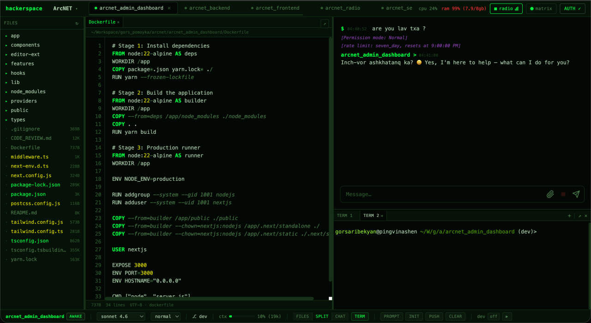

# hackerspace

A project-based terminal multiplexer and web IDE for the Claude Code CLI. Manage multiple projects and subprojects from a single browser tab with an interactive terminal, file editor, and real-time agent chat.



<!-- Add your screenshots to a `screenshots/` folder:
  screenshots/main.png       — Split view with file editor + chat
  screenshots/terminal.png   — Maximized terminal
  screenshots/limits.png     — Usage limits modal
  screenshots/themes.png     — Theme switcher
-->

## Features

- **Multi-project management** — Switch between projects via a registry (`projects.json`). Each project's subdirectories become tabs (agents) with their own working directory.
- **Interactive terminal** — Full PTY shells powered by `node-pty` and `xterm.js`. Multiple terminal tabs per subproject, with Fish shell auto-detection.
- **File editor** — Syntax-highlighted editor with multi-tab support, line numbers, autosave, and "Add to chat" selection tool.
- **Agent chat** — Stream commands to the Claude Code CLI with markdown rendering, collapsible tool calls, clickable file paths, and thinking animations.
- **Layout modes** — Files only, chat only, or split view with resizable panes. Each panel can be maximized/minimized with `Option + Cmd + Enter`.
- **Themes** — Five built-in color themes: midnight, matrix, cyber, phantom, amber.
- **System stats** — Live CPU and RAM usage in the top bar.
- **Usage limits** — Real-time rate limit tracking with a detailed breakdown modal.
- **Dev server control** — Start/stop `npm run dev` per project with automatic port detection.
- **Git integration** — Branch, dirty count, ahead/behind indicators in the status bar. One-click commit and push.

## Requirements

- **Node.js** >= 18
- **claude** CLI on PATH ([Claude Code](https://docs.anthropic.com/en/docs/claude-code))
- **git** (for status bar integration)
- macOS recommended (uses `osascript` for folder picker, `lsof` for port management)

## Install

```bash
git clone <repo-url> hackerspace
cd hackerspace
npm install
```

## Configuration

Copy the example environment file and edit as needed:

```bash
cp .env.example .env
```

| Variable | Default | Description |
|---|---|---|
| `ANTHROPIC_API_KEY` | — | API key (alternative to OAuth via `claude auth login`) |
| `PORT` | `3000` | Server port |
| `ROOT` | cwd | Initial project root (also accepts CLI arg) |
| `DEBUG` | — | Enable verbose logging |

### Projects registry

`projects.json` stores your project list and active project. You can edit it directly or manage projects from the UI.

```json
{
  "projects": [
    { "name": "MyProject", "path": "/absolute/path/to/project" }
  ],
  "active": "/absolute/path/to/project"
}
```

## Usage

```bash
npm start
# or with a specific project root:
node server.js /path/to/project
```

Open `http://localhost:3000` (or your configured port).

### Keyboard shortcuts

| Shortcut | Action |
|---|---|
| `Option + Cmd + Enter` | Maximize/minimize focused panel (terminal, files, or chat) |
| `Option + Cmd + ,` / `.` | Switch terminal tabs |
| `Option + 1` / `2` / `3` | Switch layout (files / split / chat) |
| `1`–`9` | Switch subproject tab (when chat input not focused) |
| `Cmd + S` | Save current file |
| `Escape` | Close maximized panel / modal / file editor |

## Architecture

```
hackerspace/
├── server.js          # Express + WebSocket server, PTY management, Claude CLI bridge
├── public/
│   ├── index.html     # Single-page app (HTML + CSS + JS, no build step)
│   └── favicon.svg
├── projects.json      # Project registry (gitignored)
├── .env               # Environment config (gitignored)
├── .env.example
└── package.json
```

- **Backend**: Express serves the SPA and JSON API. WebSocket handles real-time agent output, PTY I/O, and status updates. Each agent tab spawns a `claude` CLI process with streaming JSON.
- **Frontend**: Single HTML file with inline CSS and JS. Uses highlight.js for syntax highlighting, xterm.js for terminal emulation, and vanilla DOM manipulation. No framework, no bundler.
- **Per-project config**: Stored in `<project>/.hackerspace/config.json` (system prompts, agent settings).

## API endpoints

| Method | Path | Description |
|---|---|---|
| GET | `/projects` | Current project info and tabs |
| POST | `/switch-root` | Switch active project |
| GET | `/files?dir=` | List directory contents |
| GET | `/file-content?path=` | Read file content |
| POST | `/file-content` | Write file content |
| GET | `/system-stats` | CPU and RAM usage |
| GET | `/git-status?cwd=` | Git branch and status |
| GET | `/auth-status` | Authentication status |
| POST | `/auth-apikey` | Set API key |

## License

MIT
